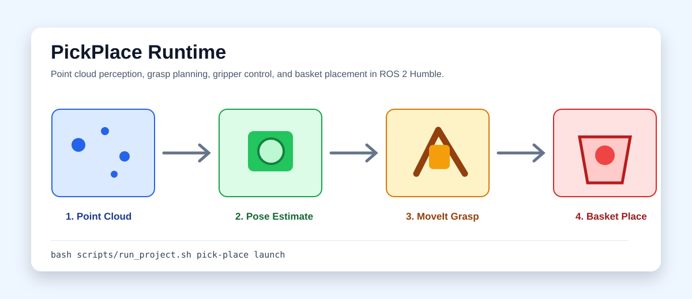
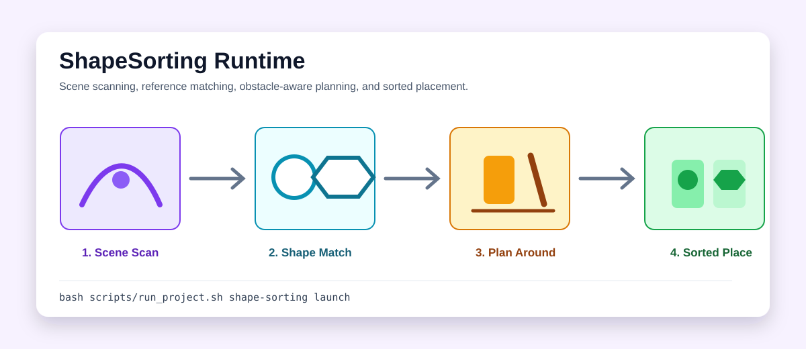

# RobotManipulation

[English](README_en.md)

RobotManipulation 是一个 ROS 2 Humble 机器人操作工作空间，整合 `PickPlace` 和 `ShapeSorting` 两个仿真操作演示。项目覆盖点云感知、目标定位、MoveIt 运动规划、夹爪控制、场景重扫、形状识别和分类放置。

外部 spawner 包名保留为仿真接口兼容项；自有 ROS 包使用功能命名：`pick_place_solution` 和 `shape_sorting_solution`。


## 功能说明

| 模块 | 能力 |
| --- | --- |
| `PickPlace` | 从 Realsense 点云中过滤桌面、定位目标和篮筐，规划抓取与放置动作 |
| `ShapeSorting` | 识别 nought/cross 物体，估计位姿，注册障碍物并完成分类放置 |
| 运动规划 | 使用 MoveIt 位姿目标、笛卡尔接近/撤离路径和失败回退 |
| 稳定性处理 | 通过重扫、重试、放置偏移和回 home 行为降低仿真时序波动 |
| 项目入口 | 根级 `scripts/run_project.sh` 统一转发两个子演示，`summary` 模式不依赖 ROS |

## 运行过程展示

PickPlace 从点云采样开始，经过目标位姿估计和 MoveIt 抓取规划，最后将物体放入篮筐。



ShapeSorting 先扫描场景，再对 nought/cross 参考形状进行匹配，并在有障碍的场景中规划分类放置。



## 结果展示

| 子项目 | 运行场景 | 关键输出 | 本地记录表现 |
| --- | --- | --- | --- |
| `PickPlace` | 已知物体抓放、扫描定位抓放、重复抓放 | 目标点云簇、篮筐位置、抓取位姿、放置结果 | 三个场景在课程验收阶段均记录为可完成 |
| `ShapeSorting` | 单物体识别、参考形状匹配、避障分类放置 | nought/cross 分类、障碍注册、分类篮筐放置结果 | 三个场景在课程验收阶段均记录为可完成 |

> **结果数据说明**：上表"本地记录表现"来自课程作业验收阶段的运行记录（详见 `archive/`），并非本仓库自动生成或可一键复现的指标——早期版本曾写"稳定性超过90%"这类具体数字，但仓库内没有配套的日志、统计脚本或视频能重新推导出该数字，因此这里改为如实描述"记录为可完成"，不再给出未经验证的百分比。若需要量化复现，需要在下方"环境要求"里提到的仿真依赖齐备的前提下重新采集数据。

结果摘要：

- `docs/results/manipulation_summary.md`
- `docs/images/pick-place-run.svg`
- `docs/images/shape-sorting-run.svg`

## 快速上手

不依赖 ROS 的项目摘要：

```bash
bash scripts/run_project.sh summary
```

构建并运行 PickPlace：

```bash
cd PickPlace
bash scripts/setup_environment.sh
bash scripts/run_demo.sh launch
```

构建并运行 ShapeSorting：

```bash
cd ShapeSorting
bash scripts/setup_environment.sh
bash scripts/run_demo.sh launch
```

也可以通过根级入口转发：

```bash
bash scripts/run_project.sh pick-place launch
bash scripts/run_project.sh shape-sorting launch
```

触发仿真场景服务：

```bash
bash scripts/run_project.sh pick-place task 1
bash scripts/run_project.sh pick-place task 2
bash scripts/run_project.sh pick-place task 3
bash scripts/run_project.sh shape-sorting task 1
bash scripts/run_project.sh shape-sorting task 2
bash scripts/run_project.sh shape-sorting task 3
```

## 环境要求

- ROS 2 Humble
- MoveIt
- Gazebo
- PCL、TF2、ros2_control 相关依赖
- 对应的 world spawner 仿真接口包：`PickPlace` 依赖 `cw1_world_spawner`，`ShapeSorting` 依赖 `cw2_world_spawner`。**这两个包是课程私有资产，未包含在本仓库中**，外部环境无法直接获取；因此本仓库定位为"代码架构与实现思路展示"，不保证第三方能够开箱即用地完整运行仿真。若需要复现，需要自行实现或替换等效的仿真世界生成节点。

## 数据说明

项目使用仿真场景和本地形状资产，不依赖外部数据集。`ShapeSorting/src/shape_sorting_solution/data/` 包含 nought/cross 的 STL 与 PCD 参考资产；完整运行需要本地 ROS 2 和仿真器环境。

## 目录结构

```text
PickPlace/                              抓取放置演示
ShapeSorting/                           形状分类放置演示
scripts/run_project.sh                  根级运行入口
docs/images/                            README 预览图和运行流程图
docs/results/manipulation_summary.md    结果摘要
tests/                                  无 ROS 结构测试
archive/                                原始材料归档
```

## 测试

```bash
pytest tests/ -q
```
