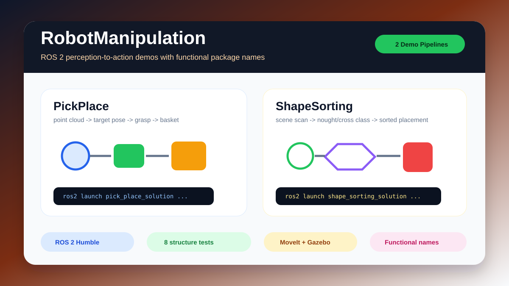

# RobotManipulation

[中文](README.md)

RobotManipulation is organised as two independent ROS 2 robotics projects. The original submission archives are preserved under `archive/`, while the current entry points use functional project names.



## Results

| Showcase item | Current result | Notes |
| --- | --- | --- |
| Independent demos | `PickPlace` / `ShapeSorting` | Two ROS 2 Humble manipulation projects |
| Perception chain | point cloud -> pose / shape class | From object localisation to grasping or sorting |
| Engineering entry points | `pick_place_solution`, `shape_sorting_solution` | Owned ROS packages now use functional names |
| Lightweight verification | 8 structure tests | README, scripts, and package metadata checked without ROS |

## Core Features

- Contains two ROS 2 manipulation pipelines: point-cloud pick-and-place, and nought/cross shape recognition with sorting.
- Renames project-owned ROS packages to `pick_place_solution` and `shape_sorting_solution` while retaining external spawners for simulator compatibility.
- Provides no-ROS structure tests that validate README coverage, shell scripts, CMake/package metadata, and source paths.

## Reproducibility Boundaries

- Full demos require ROS 2 Humble, MoveIt, Gazebo, and the simulator spawner packages.
- GitHub Actions should avoid graphical simulation and run structure, shell syntax, and package-name consistency checks.
- `archive/` preserves original submissions, but the current functional folders are the public entry points.

| Project | Focus | Main demo | Environment |
| --- | --- | --- | --- |
| `PickPlace` | Object detection, localisation, grasping, and basket placement | Pick-and-place tasks 1-3 | ROS 2 Humble |
| `ShapeSorting` | Point-cloud shape recognition, scene scanning, and object sorting | Nought/cross manipulation tasks 1-3 | ROS 2 Humble |

## Quick Start Index

| Need | Start here |
| --- | --- |
| Pick-and-place setup | `cd PickPlace && bash scripts/setup_environment.sh` |
| Pick-and-place launch | `cd PickPlace && bash scripts/run_demo.sh launch` |
| Shape-sorting setup | `cd ShapeSorting && bash scripts/setup_environment.sh` |
| Shape-sorting launch | `cd ShapeSorting && bash scripts/run_demo.sh launch` |
| Structural tests without ROS | `conda run -n codex_python pytest tests/ -q` |

## Repository Notes

- Each project has its own README, setup script, run script, and ROS workspace folders.
- Project-owned ROS packages under `src/` use functional package names. External `cw1_world_spawner` and `cw2_world_spawner` dependencies are retained because the supplied simulator services expose those package names.
- Use the functional folder names for presentation and portfolio links.

## Quick Commands

```bash
cd PickPlace
bash scripts/setup_environment.sh
bash scripts/run_demo.sh launch
```

```bash
cd ShapeSorting
bash scripts/setup_environment.sh
bash scripts/run_demo.sh launch
```
